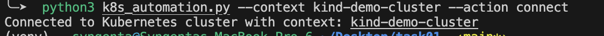
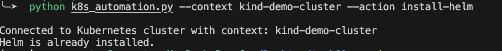
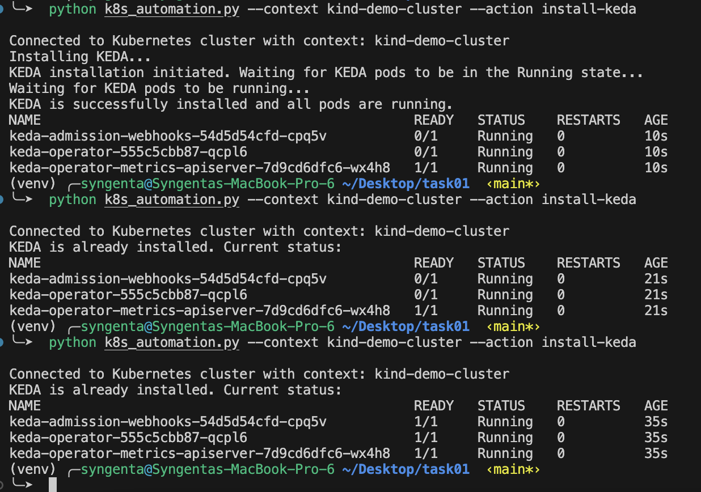

# Kubernetes Automation Script

This script automates various Kubernetes operations, including cluster connection, Helm and KEDA installation, deployment creation, and status checking.

## Table of Contents

1. [Prerequisites](#prerequisites)
2. [Installation](#installation)
3. [Usage](#usage)
4. [Actions](#actions)
   - [Connect to Cluster](#connect-to-cluster)
   - [Install Helm](#install-helm)
   - [Install KEDA](#install-keda)
   - [Create Deployment](#create-deployment)
   - [Get Deployment Status](#get-deployment-status)
5. [Examples](#examples)
6. [Troubleshooting](#troubleshooting)

## Prerequisites

- Python 3.7+
- `kubectl` installed and configured
- Access to a Kubernetes cluster

## Installation

1. Clone this repository:
```
git clone <git-url>
```

2. Create a virtual environment (optional but recommended) & Install the required packages:
```
python3 -m venv venv
source venv/bin/activate
pip install -r requirements.txt
```

## Usage

The script is run from the command line with various arguments:
```
python k8s_automation.py --context <kubernetes-context> --action <action> [additional arguments]
```

## Actions

### Connect to Cluster

Connects to the specified Kubernetes cluster.
```
python k8s_automation.py --context <kubernetes-context> --action connect
```

### Install Helm

Installs Helm if not already installed.
```
python k8s_automation.py --context <kubernetes-context> --action install-helm
```

### Install KEDA

Installs KEDA (Kubernetes Event-driven Autoscaling) using Helm.
```
python k8s_automation.py --context <kubernetes-context> --action install-keda
```

### Create Deployment

Creates a Kubernetes deployment. You can either provide individual parameters or use a YAML file.

Using parameters:
```
python k8s_automation.py --context <kubernetes-context> --action create-deployment
--image <docker-image>
--cpu-request <cpu-request>
--memory-request <memory-request>
--cpu-limit <cpu-limit>
--memory-limit <memory-limit>
--ports <port-number>
--event-source <event-source>
```

Using a YAML file:
```
python k8s_automation.py --context <kubernetes-context> --action create-deployment --file <path-to-yaml-file>
```

### Get Deployment Status

Retrieves the status of a specified deployment.
```
python k8s_automation.py --context <kubernetes-context> --action get-status --deployment-name <deployment-name>
```

## Examples

1. Connect to a cluster:
``` 
python k8s_automation.py --context minikube --action connect 
```


2. Install Helm:
```
python k8s_automation.py --context minikube --action install-helm
```


3. Install KEDA:
```
python k8s_automation.py --context minikube --action install-keda

```


4. Create a deployment using parameters:
```
python k8s_automation.py --context minikube --action create-deployment
--image nginx:latest
--cpu-request 100m
--memory-request 128Mi
--cpu-limit 200m
--memory-limit 256Mi
--ports 80
--event-source cpu
```

5. Create a deployment using a YAML file:
```
python k8s_automation.py --context minikube --action create-deployment --file ./my-deployment.yaml
```

6. Get deployment status:
```
python k8s_automation.py --context minikube --action get-status --deployment-name my-deployment
```


## Troubleshooting

- Ensure that `kubectl` is properly configured and can connect to your cluster.
- If you encounter permission issues, make sure you have the necessary rights in the Kubernetes cluster.
- For KEDA-related operations, ensure that Helm is installed and that you have permissions to install custom resources.
- If you're using a YAML file for deployment, ensure it's properly formatted and contains all necessary Kubernetes objects.

For any other issues, please check the error output and consult the Kubernetes documentation or seek help from the community.